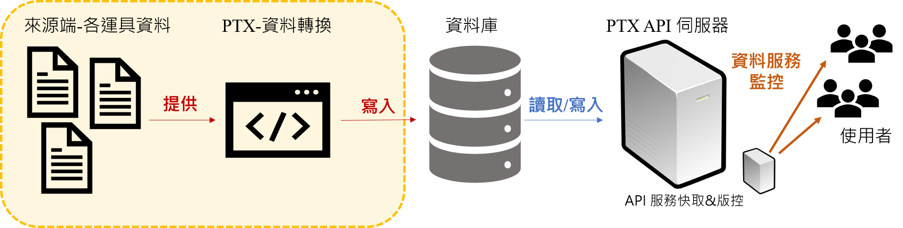

# 資料流概念

## 動態資料：

向來源端取得\(或來源端主動推送\)資料後，直接將資料透過推播機制將資料推送至各個API伺服器更新並建立快取，進而以高效率且低延遲地提供給使用者最即時的資料。

## 靜態資料：

向來源端取得\(或來源端主動推送\)資料後，直接將資料透過推播機制將資料推送至各個API伺服器更新並建立快取，進而以高效率且低延遲地提供給使用者最即時的資料。

當來源端介接資料發生異常時，API服務會以當時最新版本的資料輸出持續提供使用者服務，減少因來源端資料介接問題影響API服務之正常運作的情況發生. 

