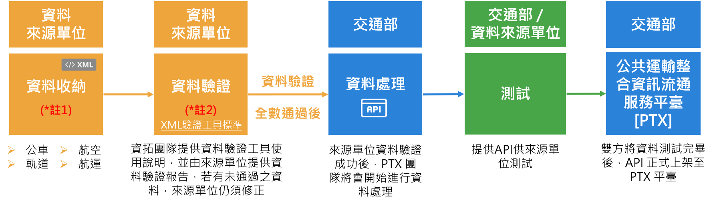

# API資料上架說明

為協助來源資料可自主檢驗所產製的資料結構與交通部所頒布的[【公共運輸旅運資料標準】](https://ptx.transportdata.tw/PTX/Data/Download)是否一致，本平臺提供[【資料驗證工具】](https://ptx.transportdata.tw/PTX/XSDValidator/Validator)，使來源單位可自行將已開發完成的API網址抑或XML資料內容透過此工具直接完整進行資料驗證，確保是否符合標準格式規範。

註1：詳細內容請參考「[XML 標準格式說明文件](https://ptx.transportdata.tw/PTX/Data/Download)」   
註2：標準XML驗證工具請參考「 [資料驗證工具](https://ptx.transportdata.tw/PTX/XSDValidator/Validator)」

