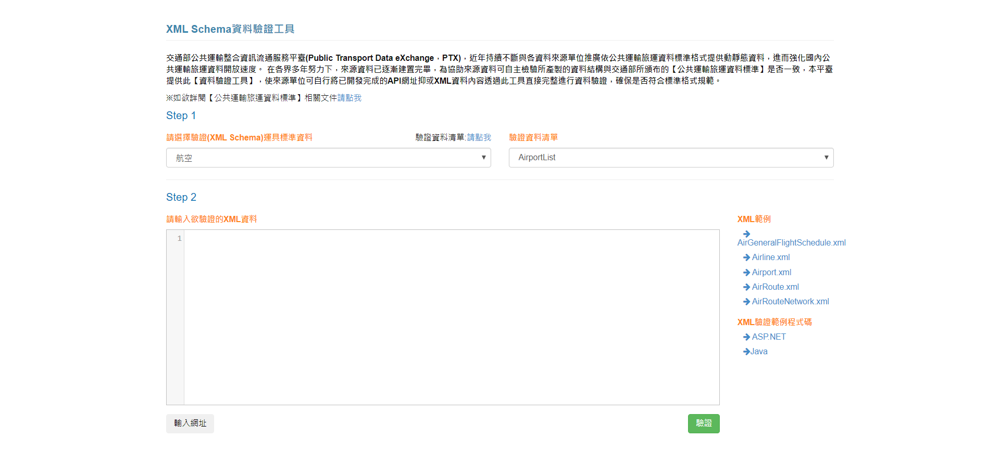
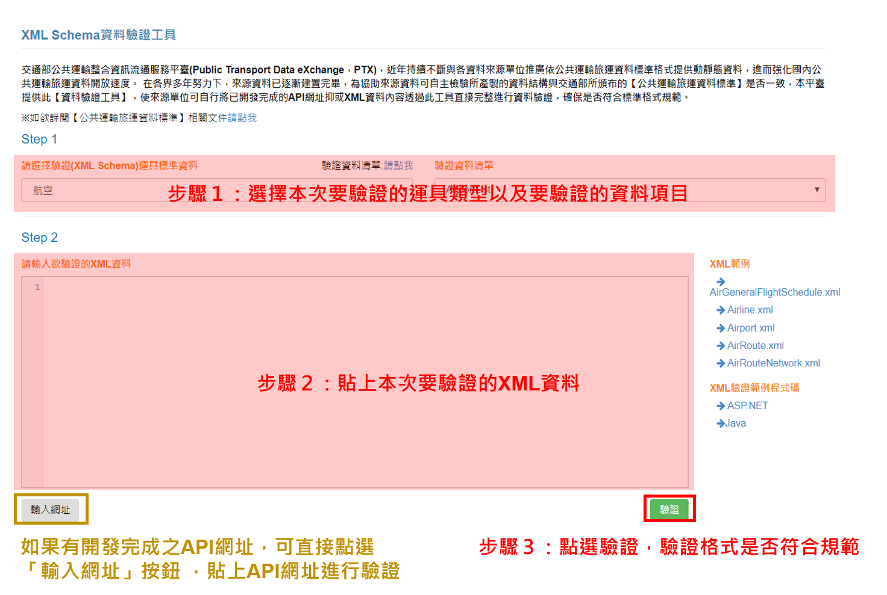
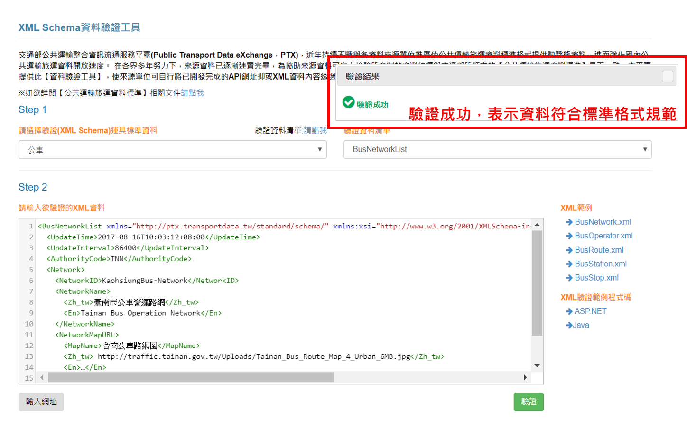
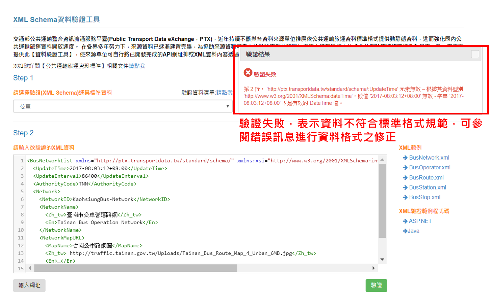

# 驗證工具說明

### 【資料驗證頁面】 

進入[PTX平臺首頁](https://ptx.transportdata.tw/PTX/)，選擇【資料標準】-&gt;[【驗證工具】](https://ptx.transportdata.tw/PTX/XSDValidator/Validator)。

### 【資料驗證程序】 

步驟1：選擇要驗證運具及資料類型   
步驟2：貼上本次要驗證的XML資料   
步驟3：點擊「驗證」 按鈕

### 【驗證成功】 

驗證成功畫面如下，表示資料符合標準格式規範，可將資料提供給PTX 團隊，進行API開發之作業。

### 【驗證失敗】 

驗證失敗，表示資料不符合標準格式規範，可參閱錯誤訊息進行資料格式之修正。

