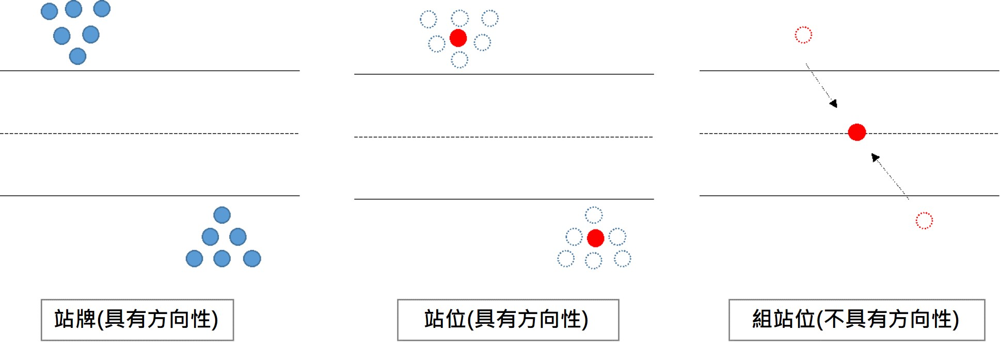

# 公車API靜態資料使用注意事項

## 靜態資料

* 站牌與站位兩者間之差異
  * **站牌Stop**：一站牌點位若有多條公車路線行經，而各個公車路線擁有各自站牌桿時，就會有多筆站牌資料，每個站牌有分去程或返程。
  * **站位Station**將道路同側、附近同一集群的站牌聚合過後的抽象點位，用來代表該處公車站位。
  * **組站位StationGroup**：公車組站位資料，與站牌、站位不同，無區分路線及方向性\(不分去程或返程\)，通常供票證資料OD旅次分析使用。

    如：StationUID為TPE50629（劍潭去程），PositionLat: 25.0807666778564，PositionLon: 121.524398803711，此站位只有一筆經緯度資料。目前僅有部分縣市市區公車與公路客運提供站位資料，可參考「[資料供應現況](https://ptx.transportdata.tw/PTX/Static/PDF_SupplyStatus.html)」。

* 為何有些公車路線GIS線型資料分去返程（分2條線型圖資），有些卻沒有分（只有1條線型圖資）？

  此現象係為來源端供應資料現狀，目前六都線型資料中僅台北與新北沒有分去返程，其餘縣市皆有分去返程，標準Inbound說明文件已將Direction去返程納入線型資料。

* 公路客運路線SubRouteID的編碼原則
  * 前四碼為路線代號 
  * 第五碼為正副路線資訊 （0：主路線，A, B...等：副路線）
  * 第六碼為去返程資訊 （1：去程，2：返程），如：路線ID為7011A2，代表此筆當時為7011副路線返程資料。
* 公路客運路線名稱SubRouteName的規則
  * 前四碼為路線編碼
  * 第五碼為正副路線資訊（0：主路線，A, B...等：副路線）
* 部分欄位若為空值是因來源單位尚未提供介接

  如：新北市N1資料因來源單位未提供StopStatus、NextBusTime、SrcRecTime及SrcUpdateTime資料，故以上欄位皆為空值。

* 新北市【NewTaipei】來源

  V1版資料由既有公車動態系統介接； V2版資料由雙北雲系統介接，106年度因來源系統變更，故將新北介接來源調整為Data.taipei。

* 為何公車的路線站牌、時刻表資料（StopOfRoute）會多一個營運業者（OperatorID）欄位？

  考量公路客運及市區公車資料屬性一致性，且來源端公路客運資料的特性同一站牌會因為分屬不同的客運業者而有不同的StopID，而預估到站資料（N1）中的StopID會與其對應，故加值業者在使用公總的StopOfRoute時，要注意對於同一路線由兩個或多個不同客運業者經營時，會有依營運業者而有不同StopOfRoute之多套清單現象。

* 顯示用路線站序（DisplayStopOfRoute）資料與路線站序（StopOfRoute）資料之差異
  * 路線站序（StopOfRoute）資料是用來儲存每條路線/附屬路線實際跑法的站序資料。
  * 實務上，有些路線中間會存在分叉後又合併之狀況（如307經西藏路、307經莒光路），所以會存在多條附屬路線的情況，此情況會導致加值業者在APP端或網頁前端不易顯示路線分支狀況，故部分縣市（如台北市及新北市）為求簡易的顯示路線站序，會定義顯示用路線站序（DisplayStopOfRoute）資料\[即台北市與新北市的Stop資料\]，嘗試以線性（Leanerly）方式來顯示該路線所有的站序，並輔以預估到站（N1）資料疊合，讓民眾於一個頁面就清楚明瞭該路線（如:307路線）所有車輛（同時含307經西藏路、307經莒光路）的預估到站資料。

    

    * 當某特定路線下不存在任何其他附屬路線時，其路線站序（StopOfRoute）資料內容會完全等同於顯示用路線站序（DisplayStopOfRoute）資料。
    * 以前顯示用路線站序（DisplayStopOfRoute）是併同在路線站序（StopOfRoute）資料中，並以KeyPattern欄位進行區分，但由於多數加值業者反應將此兩項資料加以區分以利使用，因此針對部分縣市\(如台北市及新北市）新增提供顯示用路線站序（DisplayStopOfRoute）資料，並將原路線站序（StopOfRoute）中的KeyPattern欄位刪除及將相對應的資料搬移至顯示用路線站序（DisplayStopOfRoute）資料中。
* 公車時刻表資料：

  部分市區公車路線的時刻表資料（如台北市255路線），同時會包含班距的時刻與班表的時刻（如:晚上9:00前採固定班距，之後採固定時刻表）；另外公路總局及其代管系統縣市（除六都+基隆+連江+金門）之時刻表資料，不一定含全部站點的時刻資料，有些只有重要站點才有時刻資訊；有些只有路線起始站（第1站）才有時刻資訊。

* 公路客運路線時刻表資料，會因**同一路線由多家客運業者聯營**，故會有不同客運業者有不同時刻表資料之情形。
* 起迄站中英文名稱：

  此資料欄位由各縣市來源單位提供，部分縣市並非以路線起迄站名稱提供，而是以平常慣用的路線Headsign的起迄名稱。另部分縣市如台南縣市，目前提供的迄站名稱中，並非只放一個站名，尚包含中間站名，例如：台南 \[黃6\] 路線的迄站名稱，放的是「白沙屯 ─ 後壁火車站」而非「後壁火車站」，加值業者在使用時請多加留意。

* 站牌點位資料品質：

  部分縣市站牌點位**座標經緯度值為0** （如：基隆市），是因為部分縣市站牌點位的**盤點清查作業正在進行中**，來源單位為確保資料正確性，將於資料盤點確認完畢後才能正式提供，故需耐心等候一段時間。另有關站牌點位座標的品質，交通部空間檢核技術團隊將持續於每月提供資料品質檢測報表給各相關來源單位請求修正並精進品質。

* 路線資料內HasSubRoute欄位說明：

  此欄位值與SubRoutes結構並無強烈的絕對關聯，因為有些縣市有定義附屬路線 \[如:台北/新北/公總/公總系統代管縣市\]，且無論有無實際上的附屬路線，都會賦予其SubRouteID；有些縣市雖無定義附屬路線 \[如:四都（除台北/新北）\)/基隆/金門\]，但基於資料一致性，本平台仍會為其產製一份相對應的附屬路線資料（若有去返程，則會有兩筆），以便於統一資料格式。

